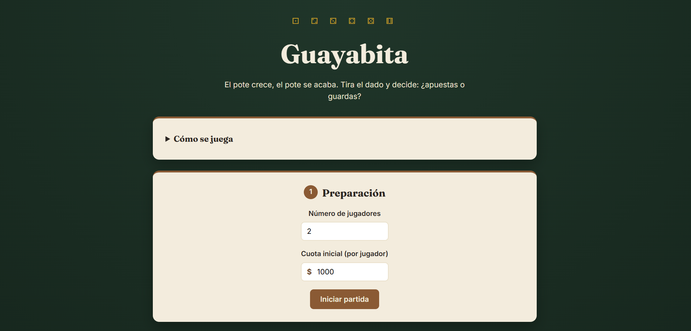
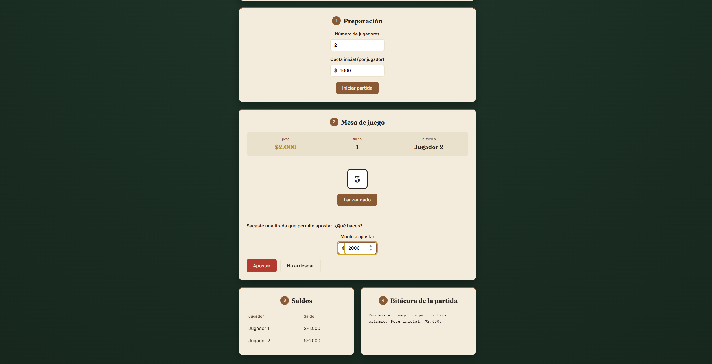

# Guayabita

Guayabita es una implementación web del juego tradicional de dados y apuestas. Permite configurar una partida, administrar el pote, realizar apuestas, consultar los saldos de los jugadores y llevar una bitácora de los movimientos realizados durante el juego.

## Capturas

### Inicio de partida



### Partida en curso



## Cómo se juega

### Preparación

- Todos los jugadores aportan una cuota inicial igual para formar el pote.
- Se define el turno inicial lanzando el dado. El jugador que obtenga el número más alto comienza.

### Lanzamiento del dado

En cada turno, el jugador lanza un dado:

- **1 o 6:** el jugador pierde el turno y debe aportar al pote una cuota adicional igual a la cuota inicial.
- **2, 3, 4 o 5:** el jugador tiene derecho a realizar una apuesta.

### La dinámica de la apuesta

Cuando el jugador obtiene un número entre 2 y 5, puede decidir cuánto dinero apostar del pote, desde una parte hasta la totalidad.

Si decide apostar, realiza un segundo lanzamiento:

- Si obtiene un número mayor al del primer lanzamiento, gana y recibe del pote la cantidad que apostó.
- Si obtiene un número igual o menor, pierde la apuesta y debe aportar al pote la cantidad apostada.
- Si decide no arriesgar, pasa el turno al siguiente jugador sin ganar ni perder dinero.

### La Guayabita

Cuando un jugador apuesta todo el dinero disponible en el pote y gana el segundo lanzamiento, se dice que **se comió la guayabita**, es decir, se lleva todo el pote.

En ese momento finaliza la partida y se muestra el resultado. Para comenzar una nueva partida, se puede utilizar la opción **"Volver a jugar"**.

## Características

- Configuración de 2 a 8 jugadores.
- Cuota inicial configurable.
- Lanzamiento de dados.
- Sistema de apuestas.
- Administración automática del pote.
- Visualización de saldos.
- Indicador del turno y jugador actual.
- Bitácora de movimientos.
- Detección del final de la partida.
- Reinicio mediante la opción "Volver a jugar".
- Diseño adaptable a diferentes tamaños de pantalla.

## Tecnologías

- HTML5
- CSS3
- JavaScript
- Google Fonts

## Estructura del proyecto

```text
guayabita/
├── src/
│   ├── inicio-partida.png
│   └── partida.png
├── index.html
├── style.css
├── main.js
└── README.md
```

## Ejecución

El proyecto no requiere instalación de dependencias.

Puedes clonar el repositorio:

```bash
git clone https://github.com/FelipeBeltranING/guayabita.git
```

Después, abre `index.html` directamente en el navegador.

Para desarrollo, también puedes utilizar **Live Server** desde Visual Studio Code.

## Objetivo

El proyecto busca desarrollar una versión digital de la Guayabita y aplicar conceptos fundamentales de desarrollo web, como:

- Manipulación del DOM.
- Manejo de eventos.
- Gestión del estado del juego.
- Actualización dinámica de la interfaz.
- Diseño responsive.
- Organización del código frontend.

## Estado del proyecto

Proyecto académico en desarrollo.